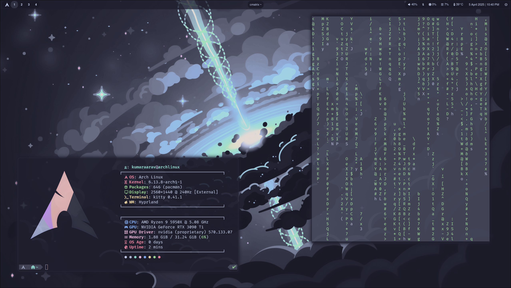
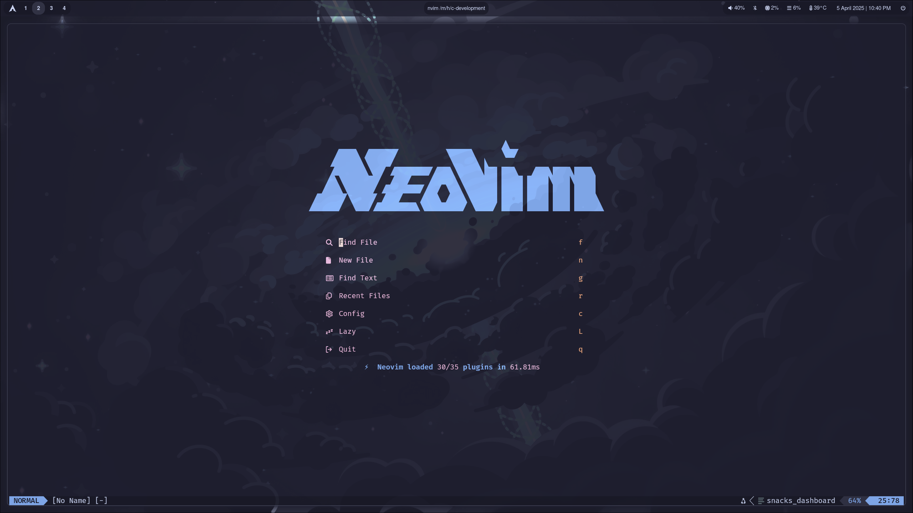

# Strxnd's Dotfiles

My personal dotfiles for a modern Linux desktop environment. This repository contains configurations for various tools and applications that make up my development and desktop environment.

##  Features

- **Window Manager**: [Hyprland](https://hyprland.org/) - A dynamic tiling Wayland compositor
- **Shell**: [Fish](https://fishshell.com/) - A smart and user-friendly command line shell
- **Terminal**: [Kitty](https://sw.kovidgoyal.net/kitty/) - A fast, feature-rich, GPU based terminal emulator
- **Editor**: [Neovim](https://neovim.io/) - A modern fork of Vim
- **Application Launcher**: [Rofi](https://github.com/davatorium/rofi) - A window switcher, application launcher and dmenu replacement
- **Status Bar**: [Waybar](https://github.com/Alexays/Waybar) - A highly customizable status bar for Wayland
- **Logout Menu**: [Wlogout](https://github.com/ArtsyMacaw/wlogout) - A wayland logout menu
- **Theme**: [Catppuccin Mocha](https://github.com/catppuccin/catppuccin) - A beautiful dark theme applied across all applications (GTK, terminal, editor, etc.)

## 󰹑 Screenshots





##  Requirements

- A GNU/Linux distribution (preferably Arch-based as I do not know about the compatibility of these packages on other distros)

## 󰏓 Installation

1. Install required packages:

```bash
# Core packages
yay -S hyprland hyprpaper hyprshot hyprlock fastfetch zoxide kitty fish rofi waybar wlogout lsd neovim stow nautilus nwg-look

# Neovim dependencies (required for )
yay -S nodejs npm ripgrep fd lazygit
```

2. Install Fish plugins:

```bash
# Install Fisher (Fish plugin manager)
yay -S fisher

# Install required plugins
fisher install patrickf1/fzf.fish ilancosman/tide catppuccin/fish jorgebucaran/autopair.fish
```

3. Clone this repository in your home directory and cd into it:

```bash
cd ~
git clone https://github.com/strxnd/dotfiles.git
cd dotfiles
```

4. Use Stow to symlink all configurations to ~/.config:

```bash
stow . -t ~/.config
```

This will create symlinks for all configuration directories in your ~/.config folder.

## 📁 Structure

```
.
├── fish/          # Fish shell configuration
├── gtk-3.0/       # GTK3 theme
├── gtk-4.0/       # GTK4 theme
├── hypr/          # Hyprland window manager config
├── kitty/         # Kitty terminal configuration
├── lsd/           # LSD file manager configuration
├── nvim/          # Neovim configuration
├── rofi/          # Rofi application launcher config
├── waybar/        # Waybar status bar configuration
└── wlogout/       # Wlogout configuration
└── fastfetch/     # Fastfetch configuration
```

## 🤝 Contributing

Feel free to submit issues and enhancement requests!
