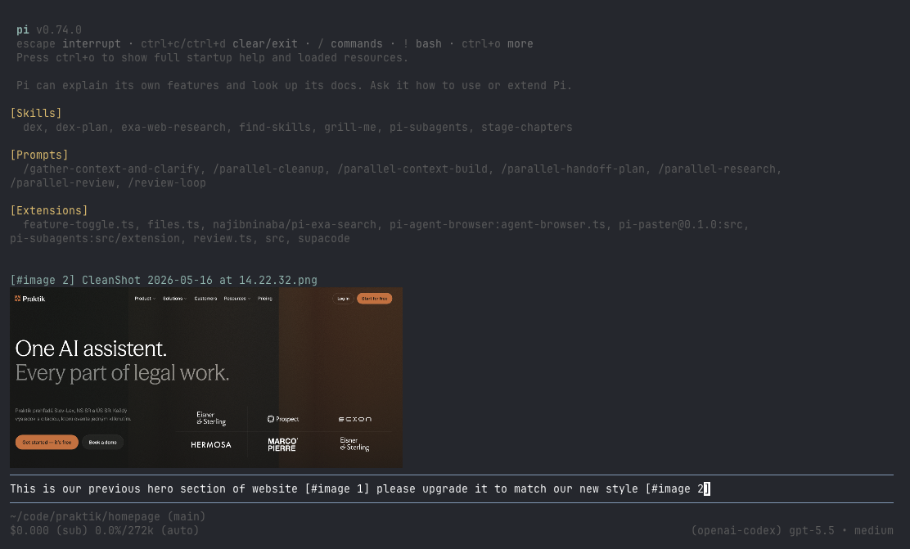

# paster

`paster` is a pi extension that turns pasted, drag-dropped, or clipboard-provided images into first-class image attachments.

Instead of leaving raw local image paths in your prompt, paster replaces them with readable placeholders such as `[#image 1]` and attaches the matching image content to the same user turn.

## Preview

<!-- Replace this with the project screenshot/demo image. -->



## Why this exists

Terminal image workflows are awkward: dragging a screenshot into a terminal usually inserts a local file path, and pasting an image from the clipboard may require special handling. Even when a model could inspect a local file through tools, that adds friction and wastes context/tool-call budget compared with attaching the image directly.

`paster` makes image input feel native in pi interactive mode:

1. Paste or drag/drop an image path into the editor.
2. The path is replaced with a placeholder like `[#image 1]`.
3. The image is stored in memory immediately.
4. When you submit, pi sends your text with the placeholder plus the actual image attachment.
5. The submitted image is rendered back in the conversation so you can confirm what was attached.

## Features

- Converts pasted or drag-dropped image paths into placeholders.
- Supports PNG, JPEG, WebP, and GIF by magic-byte detection.
- Supports absolute, relative, home-relative, quoted, and shell-escaped paths.
- Attaches only placeholders still present in the submitted prompt.
- Preserves attachment order by first placeholder occurrence.
- Shows submitted image previews in chat history.
- Provides `/image-compress` to fork the current branch into a new session where image blocks are replaced with text summaries.
- Optional custom editor integration:
  - cursor-based image preview above the input
  - atomic deletion of whole image placeholders
  - macOS clipboard image paste via pi's image paste keybinding

## Installation

Once published to npm, install the package with pi:

```bash
pi install npm:pi-paster
```

Or try it without installing:

```bash
pi -e npm:pi-paster
```

For local development/testing:

```bash
pi -e .
```

## Usage

Start pi interactive mode with the extension enabled.

Then paste or drag/drop an image path:

```text
/Users/me/Desktop/screenshot.png
```

The editor will insert:

```text
[#image 1]
```

You can also write normal text around it:

```text
What is wrong in this screenshot? [#image 1]
```

On submit, the text and matching image attachment are sent together.

## Image compression command

Run `/image-compress` to summarize every image block in the current conversation branch and switch to a new session where those image blocks are replaced by text summaries.

This is intentionally different from summarizing or compacting the whole session. Sometimes the text/tool context is still useful as-is, but screenshots are making the context heavy. Image compression preserves the same branch shape and surrounding conversation while pruning expensive image blocks into concise descriptions, so the agent keeps the relevant context without carrying every original image.

The original session is not modified. Paster copies the active branch into a new session, replaces image blocks during the copy, and links the new session back to the original as its parent. By default, paster also adds a visible collapsible compression report for the user; the report details are stored outside model context.

By default the command uses a pi subprocess with `openai-codex/gpt-5.4-mini` and a short 2-4 sentence summarization prompt. If that model is not configured or lacks credentials, paster shows a setup hint and you can configure a different summarization model. You can pass a one-off model after the command:

```text
/image-compress openrouter/google/gemini-2.5-flash
```

No extra runtime dependencies are used; the command shells out to the installed `pi` executable.

## Clipboard image paste

On macOS, pi exposes an image paste action through its keybinding system. In the default pi keybindings this is `Ctrl+V`.

`Cmd+V` is handled by the terminal emulator itself. In Ghostty, if the clipboard contains text, Ghostty pastes the text into pi; if the clipboard contains only image data, pi may receive no input. Use pi's image paste keybinding for direct clipboard-image paste.

## Configuration

By default all editor integrations are enabled, and submitted image previews render in the raw chat-history style.

To customize behavior, load a small wrapper extension:

```ts
import { createPaster } from "pi-paster";

export default createPaster({
  submittedPreviewStyle: "raw",
  includeImagePathsInPrompt: true,
  imageCompression: {
    enabled: true,
    command: "image-compress",
    model: "openai-codex/gpt-5.4-mini",
    prompt: "Summarize this image in 2-4 concise sentences.",
    includeReport: true,
  },
  customEditor: {
    enabled: true,
    showImagePreview: true,
    deletePlaceholderAsBlock: true,
  },
});
```

### Options

| Option                                  | Default                       | Description                                                                                                                             |
| --------------------------------------- | ----------------------------- | --------------------------------------------------------------------------------------------------------------------------------------- |
| `submittedPreviewStyle`                 | `"raw"`                       | How submitted image previews render in chat history. Use `"collapsible"` to wrap them in pi's ctrl+o expandable/collapsible message UI. |
| `includeImagePathsInPrompt`             | `true`                        | Appends placeholder-to-local-path mappings to the submitted prompt so the agent can manipulate the source image files when asked.       |
| `imageCompression.enabled`              | `true`                        | Registers the image compression command.                                                                                                |
| `imageCompression.command`              | `"image-compress"`            | Slash command name without the leading slash.                                                                                           |
| `imageCompression.model`                | `"openai-codex/gpt-5.4-mini"` | Model passed to pi for per-image summarization. Set to `""` to use pi's default model.                                                  |
| `imageCompression.prompt`               | built-in                      | Prompt used to summarize each image.                                                                                                    |
| `imageCompression.piCommand`            | `"pi"`                        | pi executable used for summarization subprocesses.                                                                                      |
| `imageCompression.timeoutMs`            | `120000`                      | Per-image summarization timeout in milliseconds.                                                                                        |
| `imageCompression.includeReport`        | `true`                        | Adds a visible collapsible compression report after the copied compressed branch. Report details are not sent to the agent.             |
| `customEditor.enabled`                  | `true`                        | Replaces pi's input editor with paster's editor integration. Disable this to keep pi's default editor.                                  |
| `customEditor.showImagePreview`         | `true`                        | Shows an image preview above the input when the cursor is inside an image placeholder. Requires `customEditor.enabled`.                 |
| `customEditor.deletePlaceholderAsBlock` | `true`                        | Makes backspace/delete remove the whole placeholder when editing inside or adjacent to it. Requires `customEditor.enabled`.             |

When `customEditor.enabled` is `false`, paster still handles bracketed terminal paste/drop image paths, but cursor previews, atomic placeholder deletion, and paster's clipboard-image handler are disabled.

## Development

This repo uses Vite+ via `vp` with pnpm.

```bash
vp install
vp check
vp test run
vp run build
```

The package manifest exposes the extension through:

```json
{
  "pi": {
    "extensions": ["./src/index.ts"]
  }
}
```
